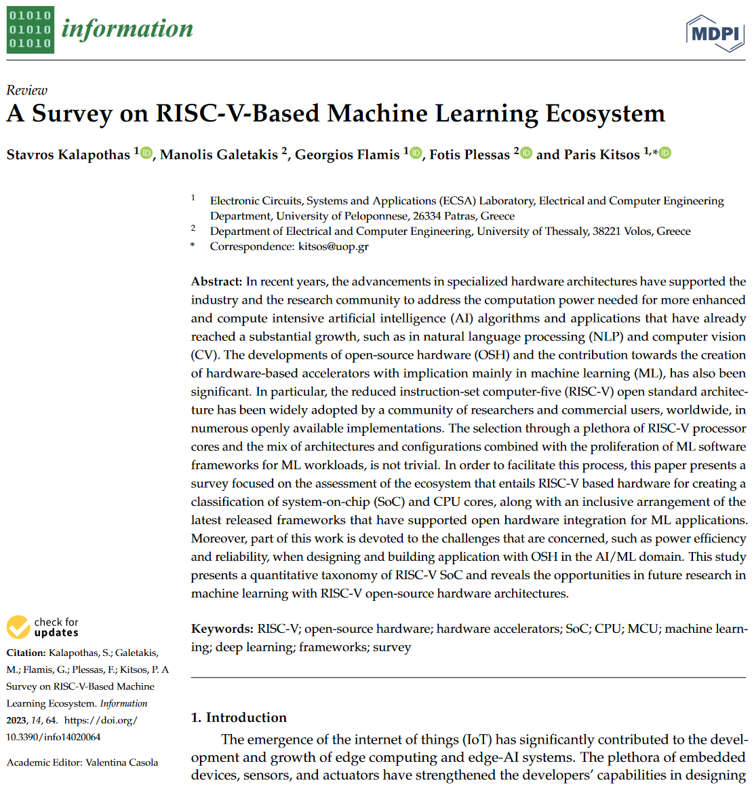

# A-Survey-on-RISC-V-Based-Machine-Learning-Ecosystem
This repo is a placeholder for the extended paper published in [MDPI Information journal, Volume 14, Issue 2 (February 2023)](https://www.mdpi.com/2078-2489/14/2/64).

# Citation
If you use this work in academic research, please cite it using the following BibTeX:
> Kalapothas, S.; Galetakis, M.; Flamis, G.; Plessas, F.; Kitsos, P. A Survey on RISC-V-Based Machine Learning Ecosystem. Information 2023, 14, 64. https://doi.org/10.3390/info14020064
```
@Article{info14020064,
AUTHOR = {Kalapothas, Stavros and Galetakis, Manolis and Flamis, Georgios and Plessas, Fotis and Kitsos, Paris},
TITLE = {A Survey on RISC-V-Based Machine Learning Ecosystem},
JOURNAL = {Information},
VOLUME = {14},
YEAR = {2023},
NUMBER = {2},
ARTICLE-NUMBER = {64},
URL = {https://www.mdpi.com/2078-2489/14/2/64},
ISSN = {2078-2489},
ABSTRACT = {In recent years, the advancements in specialized hardware architectures have supported the industry and the research community to address the computation power needed for more enhanced and compute intensive artificial intelligence (AI) algorithms and applications that have already reached a substantial growth, such as in natural language processing (NLP) and computer vision (CV). The developments of open-source hardware (OSH) and the contribution towards the creation of hardware-based accelerators with implication mainly in machine learning (ML), has also been significant. In particular, the reduced instruction-set computer-five (RISC-V) open standard architecture has been widely adopted by a community of researchers and commercial users, worldwide, in numerous openly available implementations. The selection through a plethora of RISC-V processor cores and the mix of architectures and configurations combined with the proliferation of ML software frameworks for ML workloads, is not trivial. In order to facilitate this process, this paper presents a survey focused on the assessment of the ecosystem that entails RISC-V based hardware for creating a classification of system-on-chip (SoC) and CPU cores, along with an inclusive arrangement of the latest released frameworks that have supported open hardware integration for ML applications. Moreover, part of this work is devoted to the challenges that are concerned, such as power efficiency and reliability, when designing and building application with OSH in the AI/ML domain. This study presents a quantitative taxonomy of RISC-V SoC and reveals the opportunities in future research in machine learning with RISC-V open-source hardware architectures.},
DOI = {10.3390/info14020064}
}
```




## ML Frameworks using RISC-V cores and relevant case-studies:

### ML Software Frameworks which incorporate RISC-V cores:
* [Apache Tensor Virtual Machines (TVM)](https://tvm.apache.org/)
* [CFU Playground](https://github.com/google/CFU-Playground)
* [Chipyard](https://chipyard.readthedocs.io)
* [Open ESP](https://www.esp.cs.columbia.edu/)
* [NVIDIA Deep Learning Accelerator](http://nvdla.org/)

### Case studies
 Case Study | Framework         | Core  
:----------:|:-----------------:|:-----:
 [^1]         | CFU               | VexRiscv 
 [^2]         | Chipyard          | BOOM 
 [^3]         | OpenESP           | Ariane 
 [^4]         | NVDLA             | Rocket 
 [^5]         | VHDL + LLVM/Clang | Arrow 
 [^6]         | RTL               | RISC-V2 
 [^7]         | VHDL              | Arnold 
 [^8]         | GAP-8 SDK         | GAP-8 
 [^1]: Prakash, S.; Callahan, T.; Bushagour, J.; Banbury, C.; Green, A.V.; Warden, P.; Ansell, T.; Reddi, V.J. Cfu playground: Full-stack
open-source framework for tiny machine learning (tinyml) acceleration on fpgas. arXiv 2022, arXiv:2201.01863.
 [^2]: Gonzalez, A.; Zhao, J.; Korpan, B.; Genc, H.; Schmidt, C.; Wright, J.; Biswas, A.; Amid, A.; Sheikh, F.; Sorokin, A.; et al. A 16
mm2 106.1 GOPS/W Heterogeneous RISC-V Multi-Core Multi-Accelerator SoC in Low-Power 22 nm FinFET. In Proceedings of
the ESSCIRC 2021—IEEE 47th European Solid State Circuits Conference (ESSCIRC), Grenoble, France, 13–22 September 2021;
pp. 259–262. https://doi.org/10.1109/ESSCIRC53450.2021.9567768.
 [^3]: Giri, D.; Chiu, K.L.; Eichler, G.; Mantovani, P.; Chandramoorth, N.; Carloni, L.P. Ariane+ NVDLA: Seamless third-party IP
integration with ESP. In Proceedings of the Workshop on Computer Architecture Research with RISC-V (CARRV), Virtual
Workshop, 29 May 2020.
 [^4]: Feng, S.; Wu, J.; Zhou, S.; Li, R. The Implementation of LeNet-5 with NVDLA on RISC-V SoC. In Proceedings of the 2019
IEEE 10th International Conference on Software Engineering and Service Science (ICSESS), Beijing, China, 18–20 October 2019;
pp. 39–42. https://doi.org/10.1109/ICSESS47205.2019.9040769.
 [^5]: Assir, I.A.; Iskandarani, M.E.; Sandid, H.R.A.; Saghir, M.A. Arrow: A RISC-V Vector Accelerator for Machine Learning Inference.
arXiv 2021, arXiv:2107.07169.
 [^6]: Patsidis, K.; Nicopoulos, C.; Sirakoulis, G.C.; Dimitrakopoulos, G. RISC-V2: A Scalable RISC-V Vector Processor. In Proceedings
of the 2020 IEEE International Symposium on Circuits and Systems (ISCAS), Seville, Spain, 12–14 October 2020; pp. 1–5.
https://doi.org/10.1109/ISCAS45731.2020.9181071.
 [^7]: Schiavone, P.D.; Rossi, D.; Di Mauro, A.; Gürkaynak, F.K.; Saxe, T.; Wang, M.; Yap, K.C.; Benini, L. Arnold: An eFPGA-augmented
RISC-V SoC for flexible and low-power IoT end nodes. IEEE Trans. Very Large Scale Integr. (VLSI) Syst. 2021, 29, 677–690.
 [^8]: Flamand, E.; Rossi, D.; Conti, F.; Loi, I.; Pullini, A.; Rotenberg, F.; Benini, L. GAP-8: A RISC-V SoC for AI at the Edge of the IoT.
In Proceedings of the 2018 IEEE 29th International Conference on Application-Specific Systems, Architectures and Processors
(ASAP), Milan, Italy, 10–12 July 2018; pp. 1–4. https://doi.org/10.1109/ASAP.2018.8445101.
